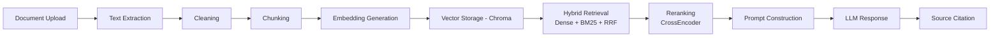
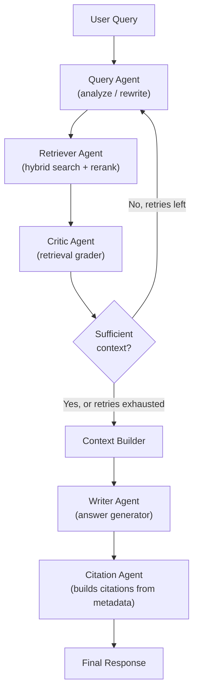

# Enterprise Knowledge Assistant (RAG)

A production-oriented Retrieval-Augmented Generation system, built to run entirely on a
laptop with a 4GB GPU (or no GPU at all) using free-tier LLM and vector database options.

- **LLM**: [Groq](https://console.groq.com) (free tier, Llama 3.3) — swappable for OpenAI, Gemini, or Anthropic via one env var
- **Vector DB**: [ChromaDB](https://www.trychroma.com/) (local, embedded, no server, no account)
- **Embeddings**: sentence-transformers, CPU-only
- **Orchestration**: LangGraph multi-agent workflow, LangSmith tracing
- **Backend**: FastAPI · **Frontend**: Streamlit

---

## Architecture

### RAG pipeline



### LangGraph multi-agent workflow



The Critic Agent's grading decision is the graph's conditional edge: if nothing relevant
was retrieved, the Query Agent rewrites the query for one retry, then the system gives up
gracefully and returns *"I don't know based on the available documents"* — it never
falls back to the LLM's own training data.

### Clean Architecture layering

```
Domain (app/core/domain, app/core/interfaces)   — no framework dependencies, pure Python
        ↑
Application (app/agents, app/services, app/graph) — orchestration, depends only on interfaces
        ↑
Infrastructure (app/rag, app/embeddings, app/repositories, app/services/llm) — concrete implementations
        ↑
Delivery (app/api, frontend)                     — FastAPI routes, Streamlit pages
```

Every infrastructure piece (Chroma, SQLite, Groq, sentence-transformers) implements an
interface defined in `app/core/interfaces/`. Swapping any of them — Chroma → Qdrant,
Groq → Anthropic, SQLite → Postgres — means writing one new class and changing one
factory function. Nothing in `app/agents/`, `app/graph/`, or `app/api/routes/` needs to change.

---

## Folder structure

```
enterprise-rag/
├── app/
│   ├── core/
│   │   ├── config/        # settings, logging, LangSmith activation
│   │   ├── domain/        # Document, Chunk, ChatMessage, Citation, etc.
│   │   └── interfaces/    # ports: EmbeddingProvider, VectorStore, LLMProvider, Reranker, Repositories
│   ├── rag/
│   │   ├── extraction/    # PDF/DOCX/TXT/MD/CSV/JSON extractors
│   │   ├── chunking/      # fixed / overlap / recursive strategies
│   │   ├── cleaning.py
│   │   └── vector_store/  # ChromaDB implementation
│   ├── embeddings/         # sentence-transformers provider
│   ├── retrieval/           # BM25, Reciprocal Rank Fusion, hybrid retriever
│   ├── reranker/             # CrossEncoder reranker
│   ├── agents/                # Query, Retriever, Critic, Writer, Citation agents
│   ├── graph/                  # LangGraph state, nodes, compiled workflow
│   ├── prompts/                 # anti-hallucination prompt templates
│   ├── services/                 # llm/ (provider factory), ingestion_service, chat_service
│   ├── repositories/               # SQLite implementations (documents, chat history)
│   ├── mcp/                          # Filesystem/SQLite/GitHub/Notion MCP server integration
│   └── api/                           # FastAPI routes, DI wiring, middleware
├── frontend/                            # Streamlit app (chat, upload, history, settings, metrics)
├── tests/
│   ├── unit/                              # chunking, cleaning, RRF, BM25, citation agent
│   └── integration/                        # FastAPI TestClient — auth, upload, chat, documents
├── docker/                                  # Dockerfile, docker-compose.yml
├── .github/workflows/ci.yml                  # test → lint → docker build
├── requirements.txt
└── .env.example
```

---

## Installation guide

### Prerequisites

- Python 3.12+
- A free [Groq API key](https://console.groq.com) (sign up, no credit card)
- Windows 11 / macOS / Linux — no GPU required

### Setup

```bash
git clone <your-repo-url> enterprise-rag
cd enterprise-rag

python -m venv venv
venv\Scripts\activate          # Windows
# source venv/bin/activate     # macOS/Linux

pip install --upgrade pip
pip install -r requirements.txt
```

> **Note:** `sentence-transformers` pulls in PyTorch (~2GB download). This happens once.
> The Dockerfile installs the CPU-only PyTorch wheel specifically to avoid pulling
> multi-gigabyte CUDA packages you don't need.

```bash
cp .env.example .env
# Edit .env and set GROQ_API_KEY=your_key_here
# Also set BACKEND_API_KEY to your own random string (used for both backend
# and frontend — the frontend reads it from BACKEND_API_KEY too)
```

### Run locally

```bash
# Terminal 1 — backend
uvicorn app.main:app --reload --port 8000

# Terminal 2 — frontend
streamlit run frontend/app.py
```

Visit `http://localhost:8501` for the chat UI, or `http://localhost:8000/docs` for the
interactive FastAPI/Swagger docs.

### Run with Docker

```bash
cd docker
docker compose up --build
```

This starts both the backend (`:8000`) and frontend (`:8501`) containers, with vector
store + SQLite data persisted in a named Docker volume across restarts.

---

## Configuration reference

All configuration lives in `.env` (see `.env.example` for the full list with defaults).
Key groups:

| Group | Examples | Notes |
|---|---|---|
| LLM | `LLM_PROVIDER`, `LLM_MODEL`, `GROQ_API_KEY` | Switch providers without code changes |
| Embeddings | `EMBEDDING_MODEL`, `EMBEDDING_BATCH_SIZE` | CPU-only by default |
| Chunking | `CHUNK_STRATEGY`, `CHUNK_SIZE`, `CHUNK_OVERLAP` | `recursive` recommended |
| Retrieval | `RETRIEVAL_TOP_K`, `HYBRID_SEARCH_ENABLED`, `BM25_WEIGHT`, `DENSE_WEIGHT` | RRF fusion weights |
| Security | `BACKEND_API_KEY`, `RATE_LIMIT_PER_MINUTE`, `MAX_UPLOAD_SIZE_MB` | |
| LangSmith | `LANGCHAIN_TRACING_V2`, `LANGCHAIN_API_KEY`, `LANGCHAIN_PROJECT` | Optional but recommended |
| MCP | `MCP_FILESYSTEM_ROOT`, `MCP_GITHUB_TOKEN`, `MCP_NOTION_TOKEN` | GitHub/Notion auto-disable without a token |

---

## API documentation

Full interactive docs are auto-generated by FastAPI at `/docs` (Swagger) and `/redoc`.
Summary:

| Method | Path | Auth | Description |
|---|---|---|---|
| GET | `/health` | none | Liveness check |
| GET | `/metrics` | API key | Document counts, index size, MCP server status |
| POST | `/upload` | API key | Upload + ingest a document (PDF/DOCX/TXT/MD/CSV/JSON) |
| GET | `/documents` | API key | List all ingested documents |
| DELETE | `/documents/{id}` | API key | Remove a document and its vectors |
| POST | `/chat` | API key | Ask a question; `stream: true` for SSE token streaming |
| GET | `/history` | API key | List conversations, or fetch one via `?conversation_id=` |

All authenticated endpoints require an `X-API-Key` header matching `BACKEND_API_KEY`.

### Example: chat request

```bash
curl -X POST http://localhost:8000/chat \
  -H "X-API-Key: your-backend-api-key" \
  -H "Content-Type: application/json" \
  -d '{"query": "What is the leave policy?", "stream": false}'
```

---

## Testing

```bash
pytest tests/ -v --cov=app --cov-report=term-missing
```

37 tests across unit (chunking, cleaning, RRF, BM25, citation logic) and integration
(FastAPI TestClient — auth enforcement, upload validation, chat, document CRUD) layers.

---

## Deployment guide

1. **Environment**: set all required `.env` values as real environment variables (don't
   ship the `.env` file itself) — `GROQ_API_KEY`, `BACKEND_API_KEY`, `LANGCHAIN_API_KEY`.
2. **Persistence**: mount a volume at `/app/data` (Chroma vectors + SQLite DB) — see
   `docker/docker-compose.yml`'s `rag_data` volume for the pattern.
3. **Scaling**: SQLite and Chroma are both single-writer, appropriate for a single-instance
   deployment. For multi-instance deployments, swap `DATABASE_URL` to Postgres and the
   vector store to Qdrant/Pinecone — both swaps are isolated to one factory function each,
   thanks to the repository/port pattern used throughout.
4. **Reverse proxy**: put Nginx/Caddy in front of both containers in production, terminate
   TLS there, and tighten `CORS_ALLOWED_ORIGINS` to your real frontend domain.
5. **CI/CD**: `.github/workflows/ci.yml` runs tests, lint (black + ruff), and a Docker
   build on every push/PR. Add a deploy job (push to a registry, trigger your host) once
   you have a target environment.

---

## Known limitations

- SQLite and embedded Chroma are single-writer — fine for a personal/portfolio deployment,
  not for high-concurrency multi-user production without the Postgres/Qdrant swap above.
- The CrossEncoder reranker and embedding model both download from Hugging Face on first
  run — make sure the deployment environment has outbound internet access for that
  one-time download (subsequent runs use the local cache).
- GitHub/Notion MCP servers require their respective tokens in `.env`; without them they
  report as disabled rather than erroring, but they are not connected until configured.
